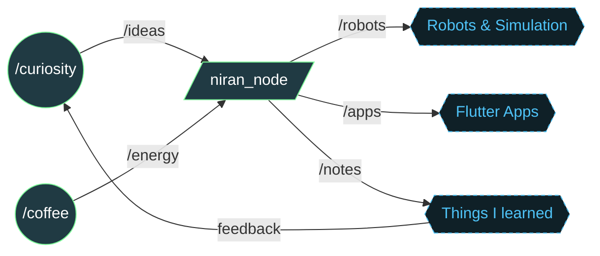

<p align="center">
  <a href="https://git.io/typing-svg"></a>
</p>

```console
niran@robot:~$ whoami
Niran S Narayanan  (nirans2002)

niran@robot:~$ cat /etc/focus
robotics, ROS 2, Flutter

niran@robot:~$ systemctl status learning.service
● learning.service - Learn everything, ship something
     Loaded: loaded (enabled; vendor preset: always-on)
     Active: active (running) since forever

niran@robot:~$ _
```

## 🧠 My brain as a ROS 2 graph



## 📦 `package.xml`

```xml
<package format="3">
  <name>niran_s_narayanan</name>
  <description>Robotics tinkerer who also makes apps</description>

  <depend>ros2</depend>          <!-- robots, nodes, topics -->
  <depend>flutter</depend>       <!-- cross-platform apps -->
  <depend>python3</depend>       <!-- glue, simulation, ML -->
  <depend>c / c++</depend>       <!-- firmware, quadruped brains -->
  <depend>arduino</depend>       <!-- microcontroller fun -->
  <depend>opencv</depend>        <!-- teaching robots to see -->
  <depend>mujoco</depend>        <!-- simulated balancing acts -->
  <depend>git</depend>

  <export>
    <build_type>learning-by-doing</build_type>
  </export>
</package>
```

## 🛰️ `ros2 topic list` (featured repos)

```text
/OpenCat                            →  quadruped robot dog (C++)
/RoboCET-Flutter-Workshop-2021      →  Flutter workshop material
/Cowin-API                          →  Flutter app + Cowin API (Dart)
/Introduction-to-Machine-Learning   →  Duke / Coursera coursework
/C_Programming                      →  C practice
```

<p align="center">
  <a href="https://github.com/nirans2002/OpenCat"></a>
  <a href="https://github.com/nirans2002/Cowin-API"></a>
</p>

## 📡 Telemetry

<p align="center">
  
  
</p>

<p align="center">
  
</p>

## 📬 `ros2 service call /contact`

<p align="center">
  <a href="https://niransnarayanan.is-a.dev"></a>
  <a href="https://www.linkedin.com/in/niran-s-narayanan/"></a>
</p>


